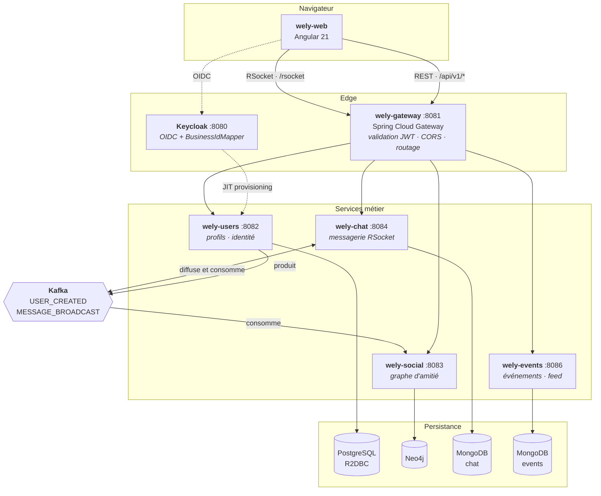
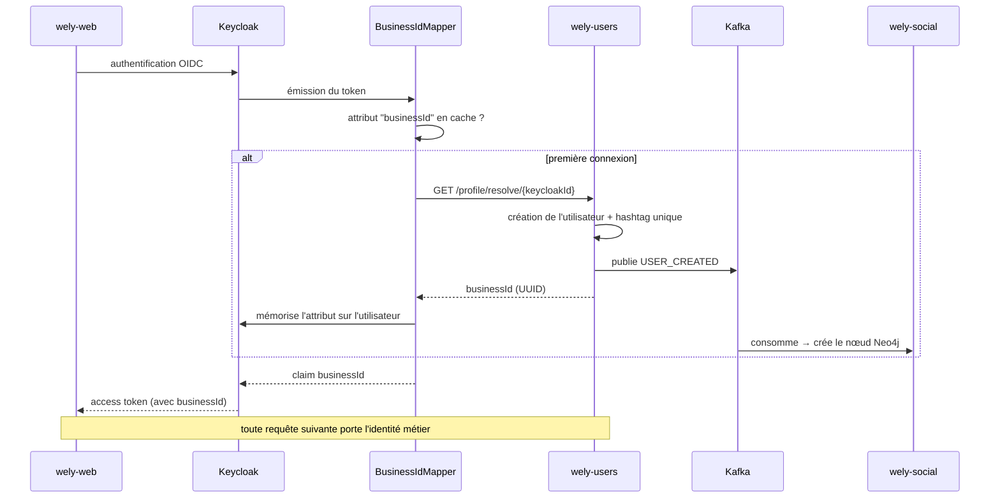
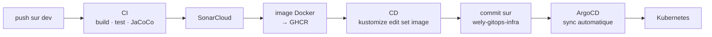

# Wely Calendar

> Réseau social de calendrier partagé, construit comme un terrain d'exploration de la **programmation réactive** et de l'**architecture microservices**.

Les utilisateurs créent des événements, s'abonnent à ceux de leurs amis et discutent en temps réel. La fonctionnalité est un prétexte : l'objet du projet est la mise en œuvre bout en bout d'une plateforme distribuée — architecture hexagonale, persistance polyglotte, communication événementielle, messagerie RSocket, déploiement GitOps.

Projet personnel, écrit intégralement à la main.

---

## Sommaire

- [Aperçu](#aperçu)
- [Architecture](#architecture)
- [Choix techniques](#choix-techniques)
- [Les dépôts](#les-dépôts)
- [Démarrage local](#démarrage-local)
- [CI/CD](#cicd)
- [Ce que ce projet m'a appris](#ce-que-ce-projet-ma-appris)
- [Limites connues](#limites-connues)

---

## Aperçu

| | |
|---|---|
| **Backend** | Java 25 · Spring Boot 4 · Spring WebFlux · Project Reactor |
| **Temps réel** | RSocket over WebSocket |
| **Événementiel** | Apache Kafka · Spring Cloud Stream |
| **Persistance** | PostgreSQL (R2DBC) · MongoDB réactif · Neo4j réactif |
| **Identité** | Keycloak · OIDC · mapper de protocole custom |
| **Frontend** | Angular 21 · Angular Material · Tailwind |
| **Infrastructure** | Kubernetes · Kustomize · ArgoCD · Sealed Secrets · Cloudflare Tunnel |
| **Qualité** | JUnit 5 · Mockito · Reactor Test · Vitest · SonarCloud · JaCoCo |
| **Livraison** | GitHub Actions · semantic-release · GHCR |

**Les chemins de requête sont non bloquants de bout en bout** : pas de `.block()`, pas de pool de threads par requête, et les quatre bases sont accédées par des drivers réactifs. La seule exception est un `DatabaseSeeder` de jeu d'essai, actif uniquement en profil local.

---

## Architecture



### Architecture interne — hexagonale

Les quatre services métier suivent la même structure. Le domaine ne connaît ni Spring, ni la base, ni le protocole. La gateway en est exclue : elle route, elle n'a pas de domaine.

```
                    ┌─────────────────────────────────┐
   HTTP / RSocket   │          application/           │
        ────────────▶   rest · dtos · mappers         │
                    └───────────────┬─────────────────┘
                                    │ appelle
                    ┌───────────────▼─────────────────┐
                    │            domain/              │
                    │   models  ·  services           │
                    │                                 │
                    │   ports/  ◀── interfaces        │
                    │     UserRepository              │  ← le domaine DÉCLARE
                    │     IdentityProvider            │    ce dont il a besoin
                    │     UserEventPublisher          │
                    └───────────────▲─────────────────┘
                                    │ implémente
                    ┌───────────────┴─────────────────┐
                    │        infrastructure/          │
                    │  persistence · messaging        │  ← l'infra S'ADAPTE
                    │  identity     · adapters        │
                    └───────────────┬─────────────────┘
                                    ▼
                          PostgreSQL · Kafka · Keycloak
```

Les services de domaine sont des **POJO sans annotation Spring**, instanciés explicitement :

```java
@Configuration
public class UsersApplicationConfig {
    @Bean
    public UserService userService(UserRepository repository,
                                   IdentityProvider identityProvider,
                                   UserEventPublisher publisher) {
        return new UserService(repository, identityProvider, publisher);
    }
}
```

C'est volontairement plus verbeux qu'un `@Service`. En contrepartie, le domaine se teste sans contexte Spring, et l'inversion de dépendance est réelle plutôt que déclarative.

### Flux d'authentification — provisioning JIT

Le problème : Keycloak connaît un utilisateur par son UUID d'IdP, l'application par son identifiant métier. Comment éviter que chaque service traduise l'un en l'autre à chaque requête ?



Un **mapper de protocole Keycloak custom** ([`BusinessIdMapper`](wely-identity/plugins/business-id-mapper/)) injecte l'identifiant métier directement dans le token. Les services lisent `jwt.getClaimAsString("businessId")` et ne font jamais confiance à un identifiant reçu du client.

La création de l'utilisateur est donc **paresseuse** : elle se déclenche à la première émission de token, pas via un webhook ni un batch de synchronisation.

### Validation du JWT derrière un ingress

Chaque service valide les tokens en dissociant deux URL :

```properties
# récupération des clés : service Keycloak interne au cluster
spring.security.oauth2.resourceserver.jwt.jwk-set-uri=${KEYCLOAK_INTERNAL_JWK_SET_URI}
# validation de l'émetteur : URL publique, celle qui figure dans le token
spring.security.oauth2.resourceserver.jwt.issuer-uri=${KEYCLOAK_ISSUER_URI}
```

Sans cette dissociation, soit le service sort du cluster pour récupérer les clés à chaque rotation, soit la validation de l'`iss` échoue parce que l'URL interne ne correspond pas à celle inscrite dans le token.

---

## Choix techniques

### Une base par service, choisie pour la forme de la donnée

| Service | Base | Raison |
|---|---|---|
| **users** | PostgreSQL / R2DBC | Données relationnelles, contrainte d'unicité `(user_name, hashtag)` garantie par la base |
| **social** | Neo4j | « amis d'amis », statut relationnel bidirectionnel, suggestions : requêtes de graphe naturelles en Cypher, pénibles en SQL |
| **chat** | MongoDB | *Bucket pattern* — voir ci-dessous |
| **events** | MongoDB | Documents autonomes, schéma souple, pas de jointure |

### Le bucket pattern pour les messages

Un document par message crée des dizaines de milliers de documents par conversation et rend la pagination coûteuse. Les messages sont donc groupés par **50 dans un document `MessageBucket`** :

```
conversations                     message_buckets
┌──────────────────┐              ┌────────────────────────────┐
│ _id              │              │ conversationId  bucketIndex│
│ participantIds[] │◀────────────▶│ messages[ 50 ]             │
│ lastMessage      │              └────────────────────────────┘
│ updatedAt        │              bucket 0 → messages 1 à 50
└──────────────────┘              bucket 1 → messages 51 à 100
```

Charger une conversation = lire **un** document (le dernier bucket). Remonter l'historique = décrémenter `bucketIndex`. Les noms de champs sont abrégés au stockage (`s_id`, `s_un`, `txt`, `ts`) pour réduire la taille des documents, et remappés vers des noms explicites par la couche de persistance.

### Kafka pour la cohérence inter-services

`wely-users` ne connaît pas `wely-social`. Il publie `USER_CREATED`, et le service social matérialise le nœud de son côté. Le couplage est un contrat d'événement, pas un appel HTTP.

```
wely-users ──▶ USER_CREATED ──▶ wely-social ──▶ nœud Neo4j
     (Postgres)          (topic Kafka)                             (graphe)
```

### RSocket plutôt que WebSocket brut

RSocket apporte le modèle `request/stream` et la **contre-pression native** : le client déclare sa demande, le serveur ne l'inonde pas. C'est cohérent avec Reactor de bout en bout, là où un WebSocket brut aurait imposé de réinventer le protocole applicatif.

---

## Les dépôts

Le projet est réparti en 8 dépôts indépendants, chacun avec son CI/CD et son cycle de release.

| Dépôt | Rôle |
|---|---|
| [`wely-web`](https://github.com/WelyLabs/wely-web) | Frontend Angular 21 |
| [`wely-gateway`](https://github.com/WelyLabs/wely-gateway) | API Gateway — point d'entrée unique |
| [`wely-users`](https://github.com/WelyLabs/wely-users) | Profils, identité, producteur Kafka |
| [`wely-social`](https://github.com/WelyLabs/wely-social) | Graphe social Neo4j, consommateur Kafka |
| [`wely-chat`](https://github.com/WelyLabs/wely-chat) | Messagerie temps réel RSocket |
| [`wely-events`](https://github.com/WelyLabs/wely-events) | Événements et abonnements |
| [`wely-identity`](https://github.com/WelyLabs/wely-identity) | Realm Keycloak + plugin `BusinessIdMapper` |
| [`wely-gitops-infra`](https://github.com/WelyLabs/wely-gitops-infra) | Manifestes Kustomize, applications ArgoCD |

Chaque dépôt a son propre README détaillant son architecture interne, ses endpoints et sa configuration.

---

## Démarrage local

### Prérequis

Java 25 · Node 20+ · Docker

### Option A — tout le cluster en une commande *(recommandé)*

Prérequis : un Kubernetes local — [OrbStack](https://orbstack.dev/), Docker Desktop, Minikube ou k3d.

```bash
cd wely-gitops-infra
kubectl apply -k overlays/local --server-side
```

Déploie les quatre bases, Keycloak, la gateway, le frontend et les quatre microservices, avec des secrets locaux préconfigurés.

| | |
|---|---|
| Frontend | http://localhost |
| Keycloak | http://localhost:8080 *(admin / admin)* |
| Gateway | http://localhost:8081 |

```bash
kubectl delete -k overlays/local        # nettoyage
```

### Option B — services en local, Keycloak en conteneur

Pour développer sur un service en particulier.

```bash
docker compose up -d      # Keycloak, avec import automatique du realm
```

> Le `docker-compose.yml` ne démarre que Keycloak : les bases doivent être lancées séparément. Un compose complet est le prochain chantier (voir [Limites connues](#limites-connues)).

Puis chaque service, avec le profil `dev` :

```bash
cd wely-gateway   && ./mvnw spring-boot:run -Dspring-boot.run.profiles=dev
cd wely-users && ./mvnw spring-boot:run -Dspring-boot.run.profiles=dev
# … idem pour social, chat, events
```

Et le frontend :

```bash
cd wely-web
npm ci --legacy-peer-deps
npm start                 # http://localhost:4200
```

### Ports

| | |
|---|---|
| 4200 | Frontend |
| 8080 | Keycloak |
| 8081 | Gateway |
| 8082 | wely-users |
| 8083 | wely-social |
| 8084 | wely-chat (HTTP + RSocket) |
| 8086 | wely-events |

### Documentation d'API

Chaque service Java sert sa propre spécification OpenAPI, sans jeton :

| Service | Swagger UI |
|---|---|
| wely-gateway | <http://localhost:8081/swagger-ui.html> |
| wely-users | <http://localhost:8082/swagger-ui.html> |
| wely-social | <http://localhost:8083/swagger-ui.html> |
| wely-chat | <http://localhost:8084/swagger-ui.html> |
| wely-events | <http://localhost:8086/swagger-ui.html> |

La spec JSON est sur `/v3/api-docs` du même port.

**Les quatre services sont en `ClusterIP`** : rien hors du cluster ne peut atteindre leur
documentation, et la gateway ne forwarde que `/api/v1/<service>/**` et `/rsocket`. Leur
documentation est donc toujours active, sans exposition possible.

**La gateway est le seul processus qu'atteint le tunnel Cloudflare**, et les règles de chemin du
tunnel sont dans Cloudflare, pas dans ce dépôt — je ne peux donc pas garantir depuis les
manifestes que `/v3/api-docs` n'est pas joignable publiquement. Sa documentation est pour cette
raison **désactivée par défaut** et activée par `SPRINGDOC_ENABLED=true`, que posent les overlays
`local` et `dev` et pas l'overlay `prod`.

> Pas d'agrégation dans la gateway. Agréger supposerait qu'elle connaisse les chemins de
> documentation de chaque service, ce qui recréerait exactement le couplage que le routage par
> préfixe évite.

---

## CI/CD



Le déploiement suit un **modèle GitOps pull** : la CD ne parle jamais au cluster. Elle met à jour le tag d'image dans le dépôt d'infrastructure, et ArgoCD — qui surveille ce dépôt avec `selfHeal: true` — réconcilie l'état réel. Le dépôt Git est la seule source de vérité ; une modification manuelle du cluster est automatiquement annulée.

Le versionnement est assuré par **semantic-release** à partir des Conventional Commits.

Le quality gate SonarCloud est un **check requis** sur `main` : une PR dont la couverture du
nouveau code tombe sous 80 %, ou qui dégrade la note de sécurité, ne peut pas être fusionnée.

---

## Tests et couverture

552 tests, exécutés à chaque push. Aucun test d'intégration : les quatre bases et Kafka sont
doublés, ce qui est la limite connue la plus coûteuse de ce projet (voir plus bas).

| Service | Tests | dont intégration | Couverture de lignes |
|---|---|---|---|
| `wely-gateway` | 26 | — | 100 % |
| `wely-users` | 86 | 10 (PostgreSQL) | 98,9 % |
| `wely-social` | 97 | 17 (Neo4j) | 90,0 % |
| `wely-chat` | 89 | 14 (MongoDB, Kafka) | 87,3 % |
| `wely-events` | 55 | 12 (MongoDB) | 92,0 % |
| `wely-web` | 252 | — | — |

Les quatre bases **et** Kafka tournent en conteneur : le round-trip de diffusion du chat traverse
un vrai broker, de `messageBroadcast-out-0` jusqu'au flux du destinataire.

Les tests d'intégration lancent un vrai conteneur et sont opt-in : la CI pose `CI=true`, en local
il faut `-Dintegration.tests=true`. La garde lit une variable d'environnement plutôt que de
sonder Docker — cette sonde se connecte au démon, et un démon lancé mais figé la fait pendre,
emportant le build avec elle.

Convention appliquée sans exception : **un fichier de test par fichier testé**, nommé d'après
lui, rangé dans la même arborescence, et couvrant chaque méthode publique — y compris les
chemins d'erreur, qui sont là où se cachent les bugs qui coûtent cher.

---

## Ce que ce projet m'a appris

**Le réactif est contagieux, et c'est le but.** Un seul appel bloquant dans une chaîne suffit à immobiliser un thread de l'event loop et à annuler le bénéfice de tout le reste. Écrire quatre services métier sans jamais recourir à `.block()` sur un chemin de requête oblige à penser en flux plutôt qu'en séquence d'instructions.

**Ne jamais souscrire à un flux que le framework doit piloter.** Appeler `.subscribe()` soi-même dans un consumer Spring Cloud Stream retire au framework la gestion de l'acquittement et de la reprise : les erreurs deviennent invisibles et les messages sont perdus en silence. C'est l'erreur que j'ai mis le plus longtemps à comprendre.

**L'architecture hexagonale coûte cher en frappe et se rembourse au test.** Tester `UserService` ne demande ni base, ni broker, ni contexte Spring — trois implémentations d'interfaces suffisent.

**La persistance polyglotte n'est justifiée que par la forme des requêtes.** Le graphe social en SQL était faisable ; en Cypher, la requête de statut relationnel bidirectionnel tient en huit lignes lisibles. À l'inverse, mettre les utilisateurs dans Mongo aurait fait perdre la contrainte d'unicité `(user_name, hashtag)` garantie par la base.

**GitOps déplace le problème au bon endroit.** Passer de « la CD déploie » à « la CD met à jour un fichier, et le cluster se réconcilie » rend l'état du système lisible dans un dépôt Git plutôt que dans l'historique d'un pipeline.

**Un test contre un double ne teste que le double.** Les classes Testcontainers ont trouvé trois bugs, chacun invisible à un test à base de mocks. Dans `wely-social`, supprimer un ami **fonctionnait et renvoyait 500** : la requête faisait `RETURN` d'une relation, que Spring Data Neo4j ne sait mapper qu'en parcourant les relations d'un nœud — le `DELETE` passait côté serveur, le mapping échouait côté client. Dans `wely-chat`, le test de concurrence a produit deux *buckets* portant le même index, ce qui prouve que la contrainte unique et la reprise sur clé dupliquée sont porteuses et pas décoratives ; et le binder Kafka n'était pas branché sur le broker de test, parce que Spring Cloud Stream ne lit pas la propriété que `@ServiceConnection` renseigne. Aucun des trois n'était atteignable autrement : ils vivent dans le mapping de Neo4j, dans le moteur de MongoDB et dans la configuration du binder.

**Une métrique qu'on configure finit par mesurer ce qu'on a configuré.** Trois services affichaient 90 % de couverture en local et 38 % sur SonarCloud, sur le même commit. Leur configuration JaCoCo excluait du rapport les adaptateurs, les contrôleurs et les modèles — avec une règle exigeant 100 % sur ce qui restait. Ces exclusions n'agissent que sur JaCoCo ; Sonar analyse tous les fichiers et compte les absents comme non couverts. La règle passait parce qu'elle ne mesurait plus les parties difficiles. En les réintégrant, un vrai bug est apparu : `Message.id` côté domaine s'appelle `messageId` côté entité, et MapStruct mappe par nom — l'identifiant de chaque message était silencieusement perdu à l'écriture comme à la lecture. Le mapper est depuis déclaré `unmappedTargetPolicy = ERROR`, ce qui transforme ce genre d'oubli en erreur de compilation.

**Un prédicat trop large attrape ce qu'on n'a pas écrit.** Chaque service réattache son préfixe de chemin avec `configurer.addPathPrefix("/events-service", HandlerTypePredicate.forAnnotation(RestController.class))`. Ce prédicat sélectionne **tous** les `@RestController` du classpath, pas seulement les miens : en branchant springdoc, sa propre ressource s'est retrouvée préfixée, la spécification servie en `/events-service/v3/api-docs` — donc derrière l'authentification — et `/v3/api-docs` répondait 404 sans que rien ne le signale. Le prédicat sélectionne désormais par package. Attention au piège suivant si l'on tente de combiner les deux critères : `HandlerTypePredicate` teste ses sélecteurs en **OU**, pas en ET.

**Un handler fourre-tout masque les statuts qu'il n'a pas prévus.** En écrivant le test qui vérifie que la documentation répond, j'ai découvert que `@ExceptionHandler(Exception.class)` interceptait aussi `ResponseStatusException` : **tout chemin inconnu renvoyait 500 au lieu de 404**, dans les quatre services. Un test de route nominale ne voit jamais ça — il faut interroger un chemin qui n'existe pas, ce qu'on ne pense pas à faire.

**Une image multi-architecture ne doit rien compiler.** L'image du frontend est publiée pour amd64 et arm64, le cluster tournant sur Raspberry Pi. Comme le `Dockerfile` construisait le bundle Angular, `buildx` le compilait une fois par plateforme — la passe arm64 sous émulation QEMU. Deux minutes sont devenues six heures, puis un job bloqué. Le bundle est désormais compilé une fois, nativement, et l'image ne fait qu'une copie de fichiers.

---

## Limites connues

Ce projet est un terrain d'apprentissage ; ces points sont identifiés et suivis, pas ignorés.

| Limite | Détail |
|---|---|
| **La diffusion des messages est au mieux-effort** | `wely-chat` tourne à deux réplicas et diffuse par Kafka, chaque pod formant son propre groupe de consommation pour recevoir tous les enregistrements. La livraison temps réel n'est pas garantie pour autant : le message est en base avant d'être diffusé, et un client qui a raté une frame recharge la conversation. Une garantie *at-least-once* demanderait un outbox côté producteur. |
| **Pas de pagination sur la recherche d'utilisateurs** | La requête Cypher parcourt tous les nœuds `User` et le filtrage est fait côté client. À remplacer par une recherche serveur paginée et indexée. |
| **La classe d'intégration Neo4j coûte ~23 min de CI** | Contre moins d'une minute pour PostgreSQL et les deux MongoDB, et ~2,5 min pour Kafka. La lenteur est propre à l'image Neo4j, pas à Testcontainers, et la cause n'est pas élucidée. Si le coût devient gênant, la sortie est de réserver les tests d'intégration à `main` et aux PR. |
| **Keycloak n'a pas de probes et il n'y a pas de `NetworkPolicy`** | Les six services applicatifs exposent Actuator et portent `startupProbe` / `livenessProbe` / `readinessProbe`, des `resources` et un `securityContext` non-root. Keycloak attend que son image soit épinglée, et rien ne restreint encore les communications entre pods. |
| **Les seuils de résilience de la gateway sont uniformes** | Un circuit breaker Resilience4j et un quota Redis par appelant protègent les cinq routes, mais avec la même configuration pour toutes — alors que `wely-social` interroge Neo4j et `wely-users` PostgreSQL, dont les latences normales diffèrent. À différencier quand il existera des mesures. |
| **Pas d'outbox transactionnel** | Si la publication de `USER_CREATED` échoue après le commit Postgres, l'utilisateur existe sans nœud social et rien ne rattrape. |
| **Démarrage local** | Le chemin complet passe par un Kubernetes local ; le `docker-compose.yml` ne lance que Keycloak. Un compose complet reste à écrire pour ceux qui n'ont pas de cluster. |

---

## Licence

Projet personnel à but pédagogique.
