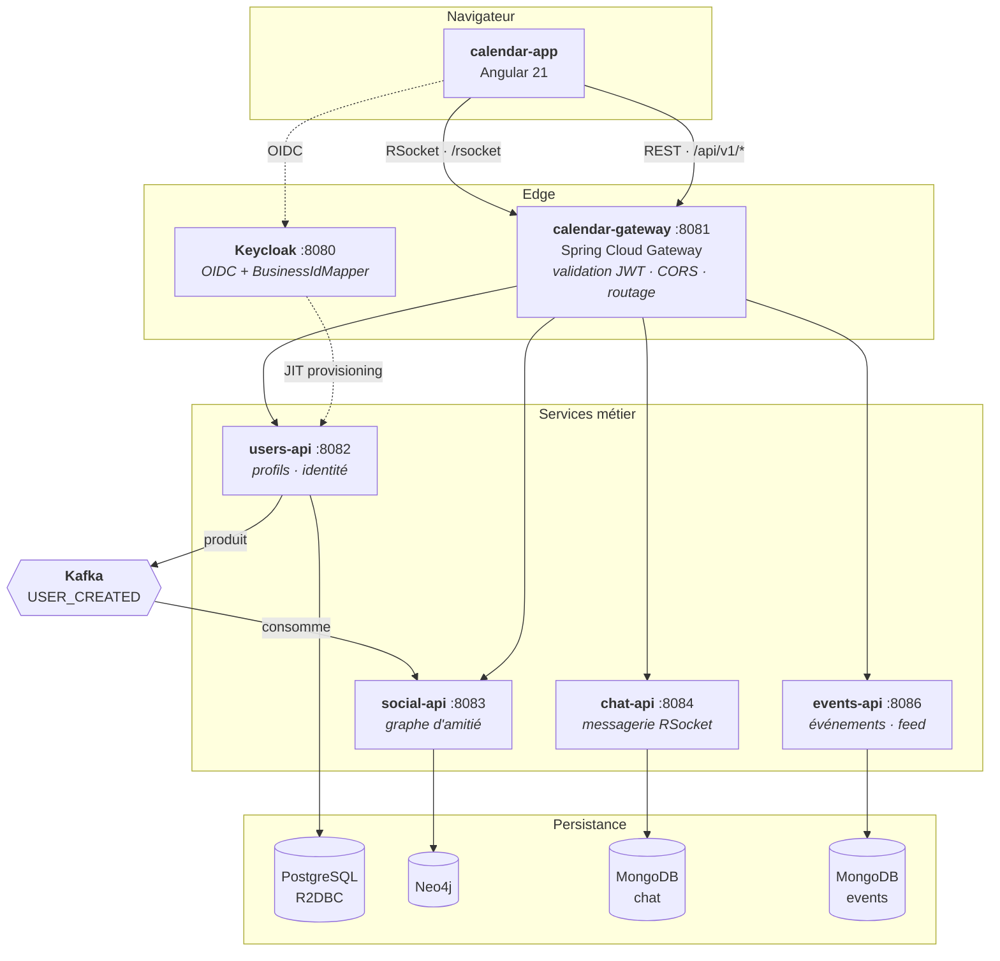
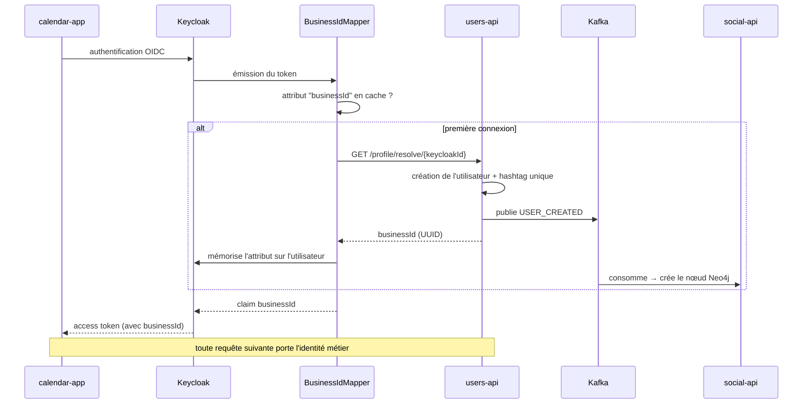
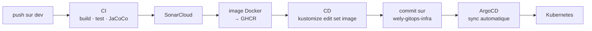

# Wely Calendar

> Réseau social de calendrier partagé, construit comme un terrain d'exploration de la **programmation réactive** et de l'**architecture microservices**.

Les utilisateurs créent des événements, s'abonnent à ceux de leurs amis et discutent en temps réel. La fonctionnalité est un prétexte : l'objet du projet est la mise en œuvre bout en bout d'une plateforme distribuée — architecture hexagonale, persistance polyglotte, communication événementielle, messagerie RSocket, déploiement GitOps.

Projet personnel, écrit intégralement à la main.

---

## Sommaire

- [Aperçu](#aperçu)
- [Architecture](#architecture)
- [Choix techniques](#choix-techniques)
- [Les dépôts](#les-dépôts)
- [Démarrage local](#démarrage-local)
- [CI/CD](#cicd)
- [Ce que ce projet m'a appris](#ce-que-ce-projet-ma-appris)
- [Limites connues](#limites-connues)

---

## Aperçu

| | |
|---|---|
| **Backend** | Java 25 · Spring Boot 4 · Spring WebFlux · Project Reactor |
| **Temps réel** | RSocket over WebSocket |
| **Événementiel** | Apache Kafka · Spring Cloud Stream |
| **Persistance** | PostgreSQL (R2DBC) · MongoDB réactif · Neo4j réactif |
| **Identité** | Keycloak · OIDC · mapper de protocole custom |
| **Frontend** | Angular 21 · Angular Material · Tailwind |
| **Infrastructure** | Kubernetes · Kustomize · ArgoCD · Sealed Secrets · Cloudflare Tunnel |
| **Qualité** | JUnit 5 · Mockito · Reactor Test · Vitest · SonarCloud · JaCoCo |
| **Livraison** | GitHub Actions · semantic-release · GHCR |

**Tout est non bloquant de bout en bout** : aucun appel bloquant, aucun `.block()`, aucun pool de threads par requête. Les quatre bases sont accédées par des drivers réactifs.

---

## Architecture



### Architecture interne — hexagonale

Les cinq services Java suivent la même structure. Le domaine ne connaît ni Spring, ni la base, ni le protocole.

```
                    ┌─────────────────────────────────┐
   HTTP / RSocket   │          application/           │
        ────────────▶   rest · dtos · mappers         │
                    └───────────────┬─────────────────┘
                                    │ appelle
                    ┌───────────────▼─────────────────┐
                    │            domain/              │
                    │   models  ·  services           │
                    │                                 │
                    │   ports/  ◀── interfaces        │
                    │     UserRepository              │  ← le domaine DÉCLARE
                    │     IdentityProvider            │    ce dont il a besoin
                    │     UserEventPublisher          │
                    └───────────────▲─────────────────┘
                                    │ implémente
                    ┌───────────────┴─────────────────┐
                    │        infrastructure/          │
                    │  persistence · messaging        │  ← l'infra S'ADAPTE
                    │  identity     · adapters        │
                    └───────────────┬─────────────────┘
                                    ▼
                          PostgreSQL · Kafka · Keycloak
```

Les services de domaine sont des **POJO sans annotation Spring**, instanciés explicitement :

```java
@Configuration
public class UsersApplicationConfig {
    @Bean
    public UserService userService(UserRepository repository,
                                   IdentityProvider identityProvider,
                                   UserEventPublisher publisher) {
        return new UserService(repository, identityProvider, publisher);
    }
}
```

C'est volontairement plus verbeux qu'un `@Service`. En contrepartie, le domaine se teste sans contexte Spring, et l'inversion de dépendance est réelle plutôt que déclarative.

### Flux d'authentification — provisioning JIT

Le problème : Keycloak connaît un utilisateur par son UUID d'IdP, l'application par son identifiant métier. Comment éviter que chaque service traduise l'un en l'autre à chaque requête ?



Un **mapper de protocole Keycloak custom** ([`BusinessIdMapper`](calendar-app-identity-service-config/plugins/business-id-mapper/)) injecte l'identifiant métier directement dans le token. Les services lisent `jwt.getClaimAsString("businessId")` et ne font jamais confiance à un identifiant reçu du client.

La création de l'utilisateur est donc **paresseuse** : elle se déclenche à la première émission de token, pas via un webhook ni un batch de synchronisation.

### Validation du JWT derrière un ingress

Chaque service valide les tokens en dissociant deux URL :

```properties
# récupération des clés : service Keycloak interne au cluster
spring.security.oauth2.resourceserver.jwt.jwk-set-uri=${KEYCLOAK_INTERNAL_JWK_SET_URI}
# validation de l'émetteur : URL publique, celle qui figure dans le token
spring.security.oauth2.resourceserver.jwt.issuer-uri=${KEYCLOAK_ISSUER_URI}
```

Sans cette dissociation, soit le service sort du cluster pour récupérer les clés à chaque rotation, soit la validation de l'`iss` échoue parce que l'URL interne ne correspond pas à celle inscrite dans le token.

---

## Choix techniques

### Une base par service, choisie pour la forme de la donnée

| Service | Base | Raison |
|---|---|---|
| **users** | PostgreSQL / R2DBC | Données relationnelles, contrainte d'unicité `(user_name, hashtag)` garantie par la base |
| **social** | Neo4j | « amis d'amis », statut relationnel bidirectionnel, suggestions : requêtes de graphe naturelles en Cypher, pénibles en SQL |
| **chat** | MongoDB | *Bucket pattern* — voir ci-dessous |
| **events** | MongoDB | Documents autonomes, schéma souple, pas de jointure |

### Le bucket pattern pour les messages

Un document par message crée des dizaines de milliers de documents par conversation et rend la pagination coûteuse. Les messages sont donc groupés par **50 dans un document `MessageBucket`** :

```
conversations                     message_buckets
┌──────────────────┐              ┌────────────────────────────┐
│ _id              │              │ conversationId  bucketIndex│
│ participantIds[] │◀────────────▶│ messages[ 50 ]             │
│ lastMessage      │              └────────────────────────────┘
│ updatedAt        │              bucket 0 → messages 1 à 50
└──────────────────┘              bucket 1 → messages 51 à 100
```

Charger une conversation = lire **un** document (le dernier bucket). Remonter l'historique = décrémenter `bucketIndex`. Les noms de champs sont abrégés au stockage (`s_id`, `s_un`, `txt`, `ts`) pour réduire la taille des documents, et remappés vers des noms explicites par la couche de persistance.

### Kafka pour la cohérence inter-services

`users-api` ne connaît pas `social-api`. Il publie `USER_CREATED`, et le service social matérialise le nœud de son côté. Le couplage est un contrat d'événement, pas un appel HTTP.

```
users-api ──▶ USER_CREATED ──▶ social-api ──▶ nœud Neo4j
 (Postgres)     (topic Kafka)                    (graphe)
```

### RSocket plutôt que WebSocket brut

RSocket apporte le modèle `request/stream` et la **contre-pression native** : le client déclare sa demande, le serveur ne l'inonde pas. C'est cohérent avec Reactor de bout en bout, là où un WebSocket brut aurait imposé de réinventer le protocole applicatif.

---

## Les dépôts

Le projet est réparti en 8 dépôts indépendants, chacun avec son CI/CD et son cycle de release.

| Dépôt | Rôle |
|---|---|
| [`calendar-app`](https://github.com/banettetheo/calendar-app) | Frontend Angular 21 |
| [`calendar-gateway`](https://github.com/banettetheo/calendar-gateway) | API Gateway — point d'entrée unique |
| [`calendar-users-api`](https://github.com/banettetheo/calendar-users-api) | Profils, identité, producteur Kafka |
| [`calendar-social-api`](https://github.com/banettetheo/calendar-social-api) | Graphe social Neo4j, consommateur Kafka |
| [`calendar-chat-api`](https://github.com/banettetheo/calendar-chat-api) | Messagerie temps réel RSocket |
| [`calendar-events-api`](https://github.com/banettetheo/calendar-events-api) | Événements et abonnements |
| [`calendar-app-identity-service-config`](https://github.com/banettetheo/calendar-app-identity-service-config) | Realm Keycloak + plugin `BusinessIdMapper` |
| [`wely-gitops-infra`](https://github.com/WelyLabs/wely-gitops-infra) | Manifestes Kustomize, applications ArgoCD |

Chaque dépôt a son propre README détaillant son architecture interne, ses endpoints et sa configuration.

---

## Démarrage local

### Prérequis

Java 25 · Node 20+ · Docker

### Option A — tout le cluster en une commande *(recommandé)*

Prérequis : un Kubernetes local — [OrbStack](https://orbstack.dev/), Docker Desktop, Minikube ou k3d.

```bash
cd wely-gitops-infra
kubectl apply -k overlays/local --server-side
```

Déploie les quatre bases, Keycloak, la gateway, le frontend et les quatre microservices, avec des secrets locaux préconfigurés.

| | |
|---|---|
| Frontend | http://localhost |
| Keycloak | http://localhost:8080 *(admin / admin)* |
| Gateway | http://localhost:8081 |

```bash
kubectl delete -k overlays/local        # nettoyage
```

### Option B — services en local, Keycloak en conteneur

Pour développer sur un service en particulier.

```bash
docker compose up -d      # Keycloak, avec import automatique du realm
```

> Le `docker-compose.yml` ne démarre que Keycloak : les bases doivent être lancées séparément. Un compose complet est le prochain chantier (voir [Limites connues](#limites-connues)).

Puis chaque service, avec le profil `dev` :

```bash
cd calendar-gateway   && ./mvnw spring-boot:run -Dspring-boot.run.profiles=dev
cd calendar-users-api && ./mvnw spring-boot:run -Dspring-boot.run.profiles=dev
# … idem pour social, chat, events
```

Et le frontend :

```bash
cd calendar-app
npm ci --legacy-peer-deps
npm start                 # http://localhost:4200
```

### Ports

| | |
|---|---|
| 4200 | Frontend |
| 8080 | Keycloak |
| 8081 | Gateway |
| 8082 | users-api |
| 8083 | social-api |
| 8084 | chat-api (HTTP + RSocket) |
| 8086 | events-api |

---

## CI/CD



Le déploiement suit un **modèle GitOps pull** : la CD ne parle jamais au cluster. Elle met à jour le tag d'image dans le dépôt d'infrastructure, et ArgoCD — qui surveille ce dépôt avec `selfHeal: true` — réconcilie l'état réel. Le dépôt Git est la seule source de vérité ; une modification manuelle du cluster est automatiquement annulée.

Le versionnement est assuré par **semantic-release** à partir des Conventional Commits.

---

## Ce que ce projet m'a appris

**Le réactif est contagieux, et c'est le but.** Un seul appel bloquant dans une chaîne suffit à immobiliser un thread de l'event loop et à annuler le bénéfice de tout le reste. Écrire cinq services sans jamais recourir à `.block()` oblige à penser en flux plutôt qu'en séquence d'instructions.

**Ne jamais souscrire à un flux que le framework doit piloter.** Appeler `.subscribe()` soi-même dans un consumer Spring Cloud Stream retire au framework la gestion de l'acquittement et de la reprise : les erreurs deviennent invisibles et les messages sont perdus en silence. C'est l'erreur que j'ai mis le plus longtemps à comprendre.

**L'architecture hexagonale coûte cher en frappe et se rembourse au test.** Tester `UserService` ne demande ni base, ni broker, ni contexte Spring — trois implémentations d'interfaces suffisent.

**La persistance polyglotte n'est justifiée que par la forme des requêtes.** Le graphe social en SQL était faisable ; en Cypher, la requête de statut relationnel bidirectionnel tient en huit lignes lisibles. À l'inverse, mettre les utilisateurs dans Mongo aurait fait perdre la contrainte d'unicité `(user_name, hashtag)` garantie par la base.

**GitOps déplace le problème au bon endroit.** Passer de « la CD déploie » à « la CD met à jour un fichier, et le cluster se réconcilie » rend l'état du système lisible dans un dépôt Git plutôt que dans l'historique d'un pipeline.

---

## Limites connues

Ce projet est un terrain d'apprentissage ; ces points sont identifiés et suivis, pas ignorés.

| Limite | Détail |
|---|---|
| **Le chat ne scale pas horizontalement** | Le fan-out des messages passe par un `Sinks.Many` en mémoire, local au processus. Au-delà d'un réplica, un message émis sur un pod n'atteint pas un destinataire connecté à un autre. Le correctif est un topic Kafka ou Redis Pub/Sub — l'infrastructure Kafka est déjà en place. |
| **Pas de pagination sur la recherche d'utilisateurs** | La requête Cypher parcourt tous les nœuds `User` et le filtrage est fait côté client. À remplacer par une recherche serveur paginée et indexée. |
| **Pas de tests d'intégration** | Les quatre bases et Kafka sont mockés. Les requêtes Cypher et R2DBC ne sont jamais vérifiées contre un vrai moteur. Testcontainers est le prochain chantier. |
| **Pas de health checks ni de limites de ressources** | Actuator absent, pas de `livenessProbe`/`readinessProbe`, pas de `resources` dans les manifestes. |
| **Pas de résilience à la gateway** | Retry simple, mais ni circuit breaker ni rate limiting. |
| **Pas d'outbox transactionnel** | Si la publication de `USER_CREATED` échoue après le commit Postgres, l'utilisateur existe sans nœud social et rien ne rattrape. |
| **Démarrage local** | Le chemin complet passe par un Kubernetes local ; le `docker-compose.yml` ne lance que Keycloak. Un compose complet reste à écrire pour ceux qui n'ont pas de cluster. |

---

## Licence

Projet personnel à but pédagogique.
